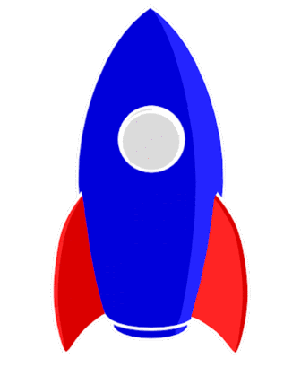

<p align="center">
  
   
</p>
<h1 align="center">Hi </img>, I'm Nguyen Ngoc Bao Tram.</h1>
<h2 align="center"> Write code | Blow minds </h2>

## **_Introduce_**

-     I'm currently final year student at **[Ton Duc Thang University.](https://tdtu.edu.vn/)**
-     My major is **[Software Engineering.](https://it.tdtu.edu.vn/)**
-     I'm focus on learning **Web and Mobile Development.**
-     In my free time, I pursue **UI/UX Design** and learn more about **Business Analysis.**
-     I have basic knowledge in **`Frontend Development` `Backend Development` `RESTful API` `Object Oriented Programming` `Data Structures and Algorithms`**.
-     My quote is **_"DO what you LOVE, and LOVE what you DO."_**

## **_Some Technologies And Tools_**

```JSON
{
  "Languages": {
    "Main": ["JavaScript", "Java", "Markdown"],
    "Basic": ["PHP", "Dart"],
  },
  "Frontend": {
    "Main": ["HTML", "CSS", "Sass", "ReactJS", "NextJS"],
    "Basic": ["jQuery"],
    "CSS Framework": ["TailwindCSS", "Bootstrap"],
    "UI": ["Ant Design", "Material UI", "Styled Components"],
    "Library": ["Redux", "React", "jQuery"],
  },
  "Backend": {
    "Main": ["NodeJS", "ExpressJS"],
  },
  "Mobile": {
    "Basic": ["React Native", "Flutter"],
  },
  "Database": {
    "Main": ["MySQL", "MongoDB"],
    "Basic": ["Microsoft SQL Server", "Firebase"],
  },
  "Version Control": ["Git", "GitHub", "GitLab", "Bitbucket"],
  "Package Manager": ["NPM", "Yarn", "PNPM"],
  "Deploy": {
    "Main": ["GitHub Pages", "Netlify", "Heroku"],
    "Basic": ["Glitch"],
  },
  "IDEs/Editors": {
    "Main": ["Visual Studio Code"],
    "Basic": ["Visual Studio", "Android Studio", "Sublime Text", "Unity"],
    "Online": ["CodePen"],
  },
  "Tools": {
    "Main": ["Postman", "XAMPP"],
    "Database": ["MySQL Workbench", "MongoDB Compass"],
    "Planning": ["Draw.io", "StarUML", "Balsamiq Wireframes"],
    "Support": ["Prettier", "Eslint", "Gitignore"],
  },
  "Design": {
    "Main": ["Figma", "Canva"],
    "NoCode": ["Wix", "Wordpress"],
    "Adobe": ["Photoshop", "Illustrator", "Lightroom", "Premiere"],
  },
}
```

## **_About Some Statistics_**

<div align="center">

</div>
<br/>


## **_For More Information, Please Check Out or Connect Me Via_**

<div align="center">

<a href="mailto:nguyenngocbaot@gmail.com" ></a>
<a href="https://github.com/baotramnguyen2000" ></a>
<a href="https://www.linkedin.com/in/baotramnguyen2000/" target="_blank"></a>
<a href="https://www.facebook.com/chamnho.156/" target="_blank"></a>
<a href="https://www.instagram.com/ngnbt_/" target="_blank"></a>

</div>

<div align="center">
  <h3>
  🥰 Thanks for watching my profile. Have a nice day! 😘 <br/>
  &copy; 2024 Nguyen Ngoc Bao Tram
  </h3>
  
</div>